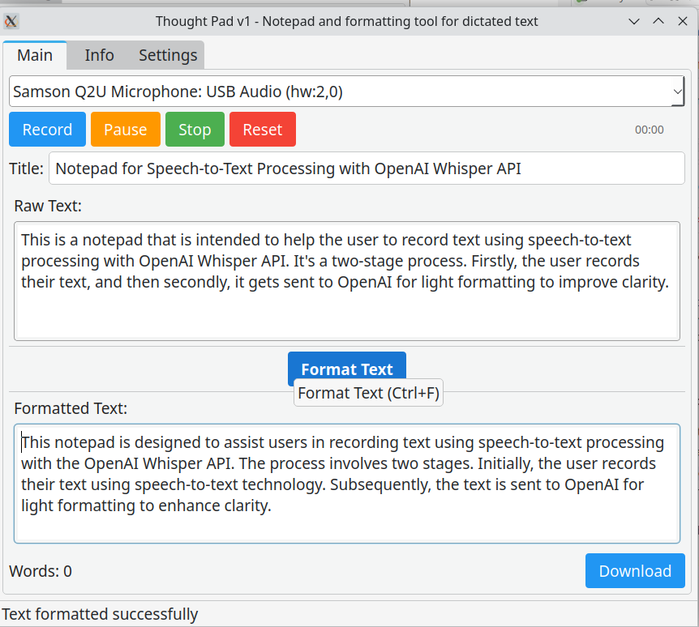
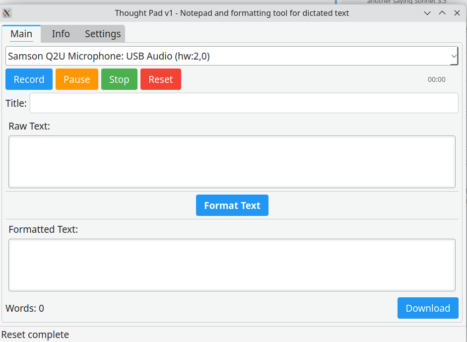
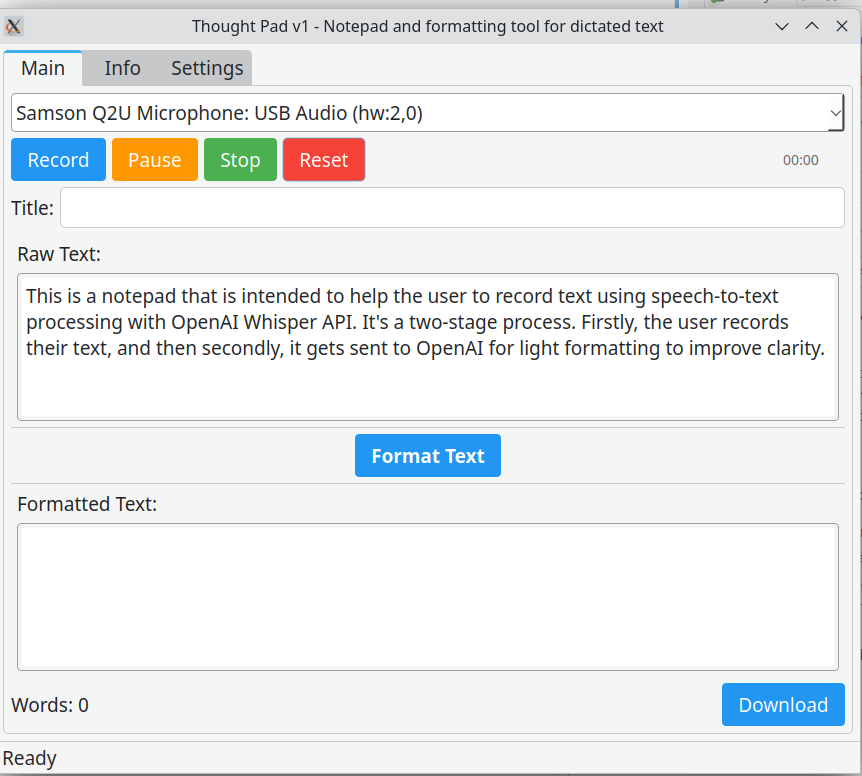
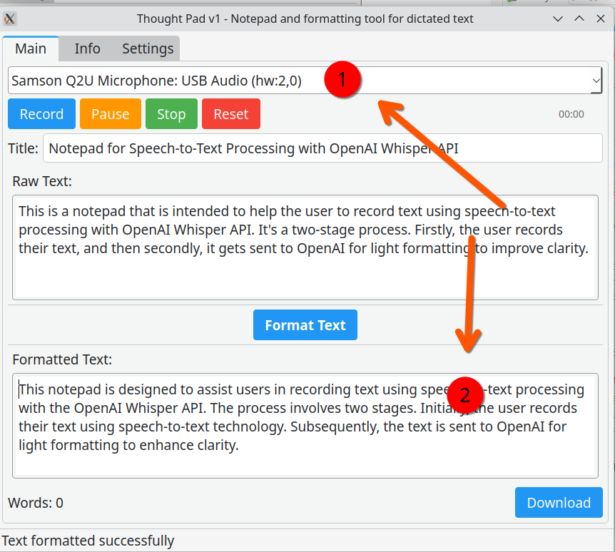
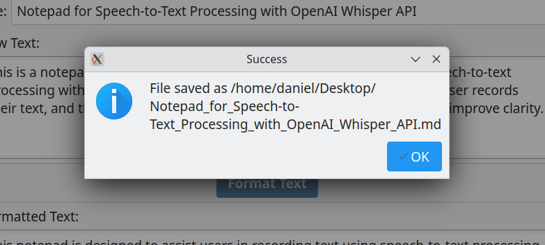
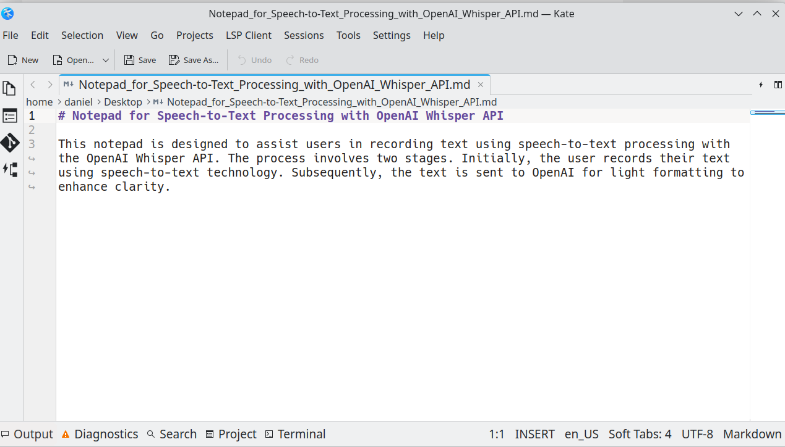

# ThoughtPad

 
 


 ThoughtPad is a note-taking utility created for the Linux desktop. 
 
 It's a speech-to-text GUI for taking your thoughts and getting them into semi-coherent text!
 
The app follows a two-stage process to create the cleaned up dictated text entries, both using OpenAI via the Whisper API (API ). 

Firstly, speech to text (STT) using Whisper AI. Next, text formatting via GPT 3.5. The optimised transcript can then be quickly downloaded as a markdown file!

 ## Use-Cases

 I created this app to streamline a common workflow where I create dictated text that requires light cleaning. 
 
 By integrating speech-to-text and text formatting functionalities from the OpenAI API, I developed a single tool to simplify this process. The program also utilizes the LLM for intelligent title generation.

My primary use case for this app is to efficiently record contextual data for a vector database. The app outputs to Markdown, but it is versatile and can be applied to various tasks like diary entries, blog creation using speech-to-text, or any other creative use you can imagine.

## Features

- Voice recording with real-time waveform visualization
- AI-powered transcription using OpenAI's models
- Export capabilities to PDF and DocX formats
- User-friendly GUI interface
- Real-time audio visualization
- Cross-platform compatibility

## Additional Features

I may get around to adding the following:

- User system prompt editing
- System prompt library (choose between one of X saved system prompts to edit the text formatting style)

## Installation

1. Clone the repository:
```bash
git clone https://github.com/danielrosehill/Thought-Pad.git
cd thoughtpad
```

2. Create and activate a virtual environment:
```bash
python -m venv .venv
source .venv/bin/activate  # On Windows use: .venv\Scripts\activate
```

3. Install dependencies:
```bash
pip install -r requirements.txt
```

## Usage

1. Run the application:
```bash
python app/main.py
```

2. Or build an executable:
```bash
python build.py
```

The built executable will be available in the `dist` directory.

## Screenshots & Usage Instructions

The main interface has an audio recording tab, an info tab, and a settings tab. Add your OpenAI API key in `Settings`.



---

Select your microphone source and hit record. Pause if required. Reset to cancel the recording (standalone cancel button to be added!)

When you hit stop, the audio will be sent for transcription to Whisper and it wil appear as "raw text".



---

Click "format text"!

This will send the raw text collected in stage 1 to GPT 3.5 with a system prompt instructing the LLM to apply some light touch edits to clean up the captured dictation just a little.


---

In a few seconds, you'll get back the formatted text (2) and an autogenerated title (1).



---

Click on download and you'll generate a markdown file with both. 

You can change/set the default download path in the settings page.



---



## Dependencies

- PyQt6 - GUI framework
- OpenAI - For audio transcription
- SoundDevice - Audio recording
- PyQtGraph - Waveform visualization
- FPDF2 - PDF export
- python-docx - DocX export

## Building from Source

The project includes a build script (`build.py`) that uses PyInstaller to create standalone executables. Run the build script to generate platform-specific executables.

## Screenshots

Screenshots of the application can be found in the `screenshots` directory.

---
*Built by Daniel Rosehill using Sonnet 3.5*
